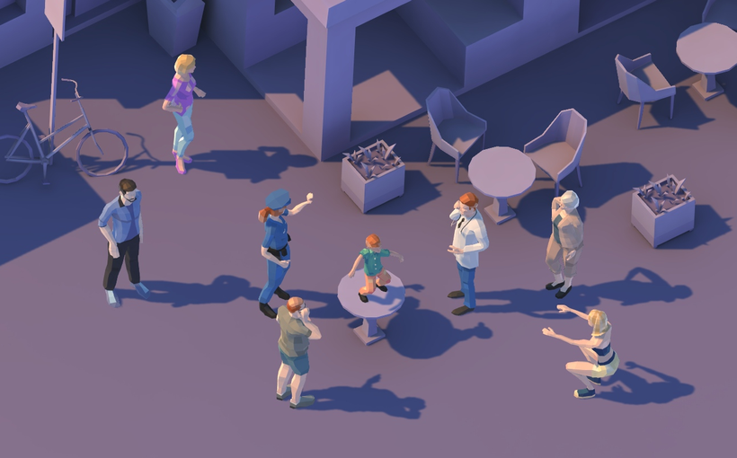
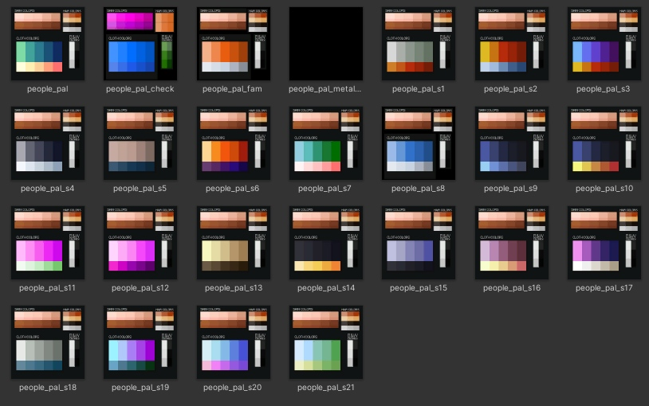

# City People FREE Samples

Welcome to the **City People FREE Samples**! This package provides a group of city characters to bring life to your Unity projects. This is a subset of [**City People Mega-Pack**](https://assetstore.unity.com/packages/3d/characters/city-people-mega-pack-203329) which contains 100+ of diverse characters.

## Table of Contents

1. [Introduction](#introduction)
2. [What's New in v1.1.0](#whats-new-in-v130)
3. [Getting Started](#getting-started)
4. [Demo Scenes](#demo-scenes)
   - [Demo Scene 1: Character Showcase](#demo-scene-1-character-showcase)
   - [Demo Scene 2: Isometric City](#demo-scene-2-isometric-city)
5. [Animations](#animations)
6. [CityPeople Component Script](#citypeople-component-script)
7. [Palette System and UV](#palette-system-and-uv)
8. [Support](#support)

---

## Introduction

These characters packs are designed to populate your urban environments with a rich variety of animated characters. The Polyart style provides optimized characters, making them suitable for low-end devices and AR/VR simulations.

## What's New in v1.1.0

- **Enhanced Demo\_1\_Showcase Scene**: Hovering over characters now increases their size (focus effect), and clicking cycles through available material palettes.
- **New Demo Scene**: Introduced **Demo\_2\_IsoCity**, an isometric view of a town populated with animated characters. A few simple buildings have been added to enhance the package with this scene.

- **CityPeople Script Update**: New method for easy material switching that intelligently replaces materials with the "people\_pal" prefix.

- **Unity 6 Compatibility**: Fully tested and compatible with Unity 6.

## Getting Started

1. **Import the Package**: Download and import into your Unity project.
2. **Explore Demo Scenes**: Open the demo scenes to see the characters in action!
3. **Drag&Drop:** Place characters from `Prefabs` folder anywhere on your scene.

## Demo Scenes

### Demo Scene 1: Character Showcase

- **File**: `Demo_1_Showcase.unity`
- **Description**: An interactive scene where you can view all characters. Hover over them to see the focus effect, and click to cycle through different material palettes. Use arrow keys or screen buttons to navigate between character groups.

### Demo Scene 2: Isometric City

- **File**: `Demo_2_IsoCity.unity`
- **Description**: A beautifully crafted isometric town scene showcasing all animated characters from a top-down orthographic perspective.

## Animations

- **Standard Characters**: A set of common animations suitable to most characters.
  - Walking (6)
  - Running (4)
  - Idle (6)
  - Dancing (5)
  - Warming Up

## CityPeople Component Script

Located in the `Scripts` folder, the **CityPeople** component script offers basic functionality to control character behaviors and appearances. 

### Key Features

- **Material Switching Method**: Easily change a character's material palette using the new method: `public void SetPalette(Material mat)`
  - **Usage**: This method replaces materials with the `people_pal` prefix while leaving other materials untouched.
- **Auto Play Animation:** Setting this field to `True` in the inspector makes the character switch animations randomly for testing and demonstration purposes. 

## Palette System and UV

The characters UV have been mapped in a way to make easy the switching of palettes. These textures (acting as palettes) have a standardized structure with areas corresponding to different surfaces of the characters:

- Skin colors
- Hair colors
- Clothes colors
- Dark and Light details.

A single texture/material pair can be applied to all the characters in this package. And any texture/material can be applied to any character.

Free tool [DA Poly Paint](https://assetstore.unity.com/packages/tools/painting/da-polypaint-low-poly-customizer-251157) can be used to further modify the UV 'painting' by model with ease.

## Support

If you have any questions or need assistance:

- **Email**: [denys.almaral@gmail.com](mailto\:denys.almaral@gmail.com)
- **Website**: [DenysAlmaral.com](https://denysalmaral.com)
- **Forum**: [Github Discussions](https://github.com/piXelicidio/Chat/discussions/2)

---

Thank you for downloading **City People FREE Samples**. We hope these assets help you create engaging and fun Unity projects!
